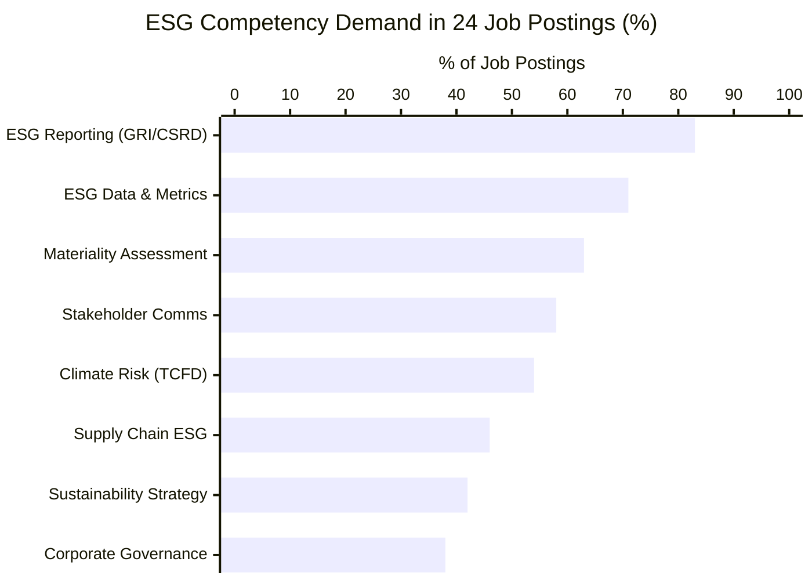
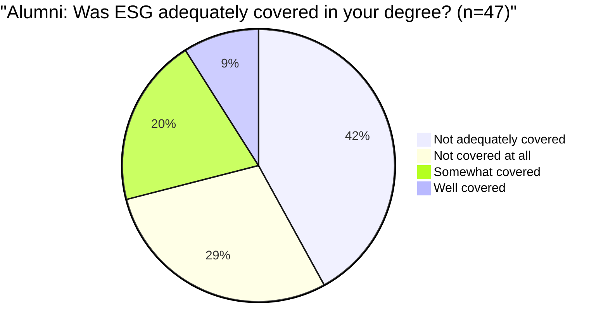
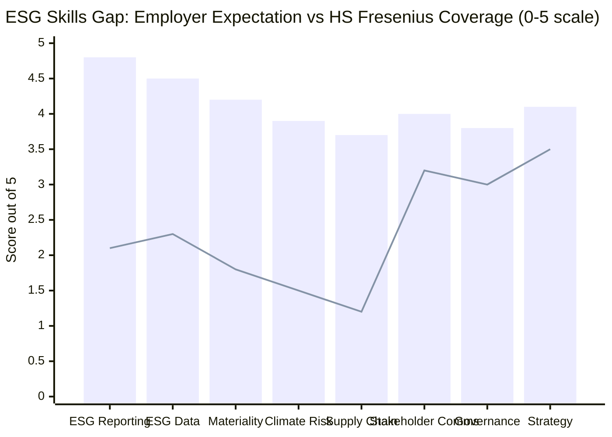
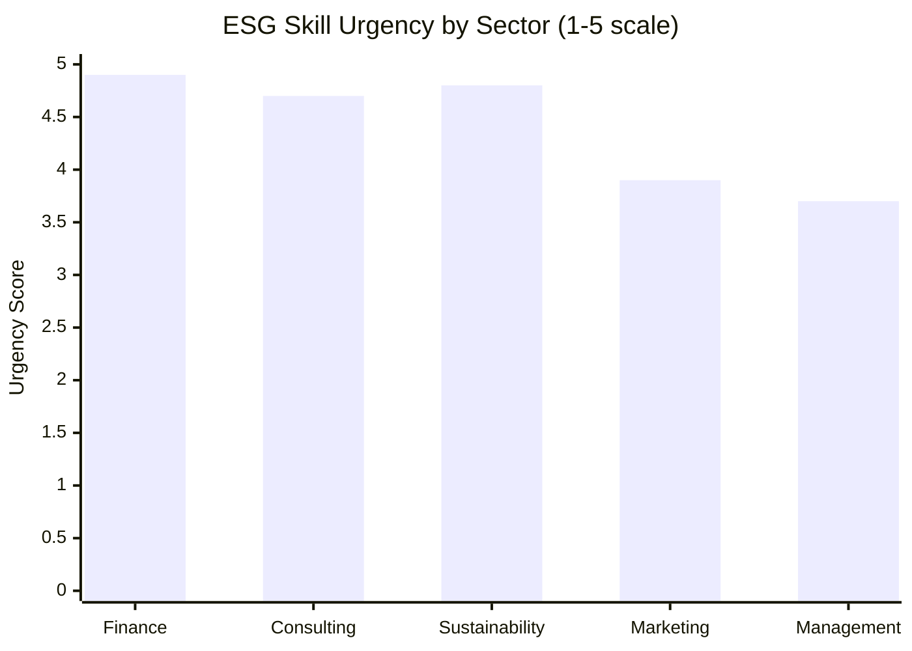
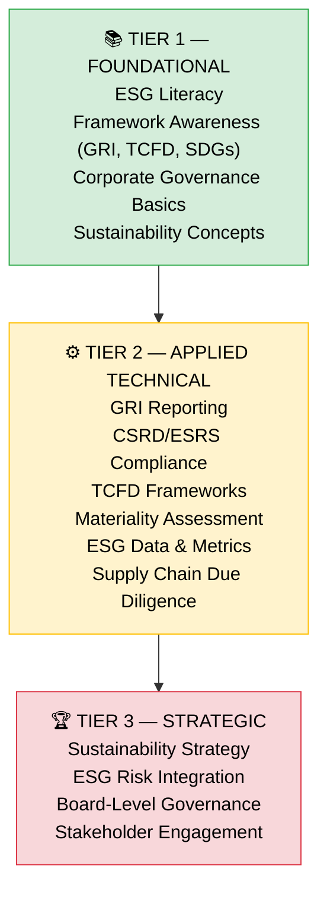
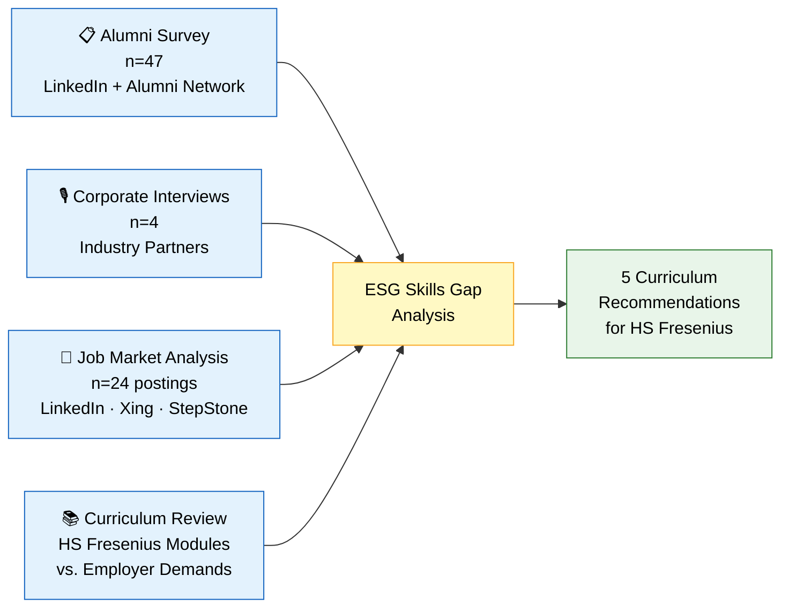

# Mermaid Diagrams — ESG Project
## How to use: Go to https://mermaid.live → paste each chart code → Export as PNG → insert into slides

---

## CHART 1 — Job Market Analysis: ESG Skills Demand
### Use on: Slide 6 (Akshat)

---

## CHART 2 — Alumni Survey Results
### Use on: Slide 7 (Akshat)

---

## CHART 3 — ESG Skills Map (Gap Analysis)
### Use on: Slide 10 (Anmol) — THIS IS THE MOST IMPORTANT CHART

> Note: Blue bars = Employer Expectation. Orange line = HS Fresenius Coverage. The wider the gap between bar and line, the bigger the problem.

---

## CHART 4 — Sector Comparison
### Use on: Slide 13 (Anmol)

---

## DIAGRAM 5 — Three-Tier Competency Framework
### Use on: Slide 5 (Akshat) — Use as a visual pyramid/ladder

> Label the gap arrow: "Most graduates stop here ↑" pointing at Tier 1/Tier 2 boundary
> Label the target arrow: "Employers expect this ↑" pointing at Tier 2

---

## DIAGRAM 6 — Research Methodology Flow
### Use on: Slide 4 (Akshat)

---

## TIPS FOR USING THESE IN SLIDES

1. Go to **mermaid.live**
2. Paste the code block (everything between the triple backticks)
3. Click the PNG download button (top right)
4. Insert into Google Slides or PowerPoint

**Chart 3 (Skills Gap) is the most important** — make it full-slide and large.
Chart 1 (Job postings) and Chart 2 (Alumni pie) support Akshat's section.
Diagrams 5 and 6 are for the methodology and framework slides.
